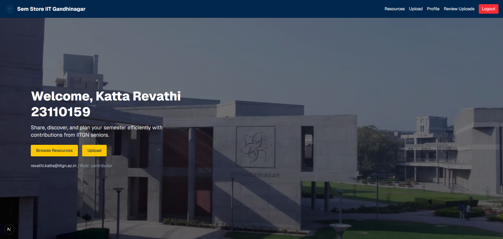

#  SemStore – Academic Resource Sharing Platform for IITGN

SemStore is a Progressive Web App (PWA) built for IIT Gandhinagar students to share and access semester-wise academic resources like PDFs, notes, past papers, and more.

##  Features

###  User Authentication
- Login restricted to IITGN students using Google OAuth (`@iitgn.ac.in` domain)
  
<div align="center">
  
</div>

- Role-based access control:
  - **Admin**: Manage users, approve resources, assign contributor roles
<div align="center">
  
</div>

  - **Contributor**: Upload, approve, edit, and delete their own resources
<div align="center">
  
</div>    
  
  - **Viewer**: Browse, upload and download resources
<div align="center">
  
</div>


###  Profile Management
- Auto-filled name, email, and profile picture from Google
- Editable fields: phone number, branch, batch, bio, profile photo
<div align="center">
  
</div>

###  Resource Upload & Management
- Upload multiple files per resource
- Contributors’ uploads are auto-approved
<div style="display: flex; flex-wrap: nowrap; overflow-x: auto; gap: 12px;">
<div align="center">
  
</div>
</div>

- Viewers’ uploads go to a pending approval system
- Admin/contributor approval dashboard
<div align="center">
  
</div>

###  Course-wise Repository
- Organized by semester, branch, and course code and filters for search
- Contributors and uploaders can edit and delete resource
<div align="center">
  
</div>

- Viewer can report outdated or wrong resources
<div align="center">
  
</div>

###  Progressive Web App (PWA)
- Installable on mobile/desktop
- Offline support for cached content
- Optimized load speed

###  Notifications & Moderation 
- Admin panel with two tabs one for handling reports and other to modify default, assign new roles to users.
<div align="center">
  
</div>

<div align="center">
  
</div>

- Notification system for uploads, replies, and announcements (in progress)

---

## Tech Stack

- **Frontend**: Next.js 15 + Tailwind CSS
- **Backend & DB**: Firebase (Auth, Firestore, Functions)
- **Storage**: Cloudinary (for uploaded files)
- **Deployment**: Vercel
- **Version Control**: Git + GitHub

---

##  Local Setup

```bash
git clone https://github.com/Revathi-katta/SemStore_Web_App.git
cd SemStore_Web_App
npm install
npm run dev
```


##  Development Timeline

- 🔹 Setup Firebase Auth & Firestore DB
- 🔹 User profile page with role-based data
- 🔹 Upload & pending approval system
- 🔹 Integrated Cloudinary for free file uploads
- 🔹 Course-wise display with search and filters
- 🔹 Contributor-only editing & deletion
- 🔹 PWA setup and deployment (ongoing)

---
This is a [Next.js](https://nextjs.org) project bootstrapped with [`create-next-app`](https://github.com/vercel/next.js/tree/canary/packages/create-next-app).

## Getting Started

First, run the development server:

```bash
npm run dev
# or
yarn dev
# or
pnpm dev
# or
bun dev
```

Open [http://localhost:3000](http://localhost:3000) with your browser to see the result.

You can start editing the page by modifying `app/page.js`. The page auto-updates as you edit the file.

This project uses [`next/font`](https://nextjs.org/docs/app/building-your-application/optimizing/fonts) to automatically optimize and load [Geist](https://vercel.com/font), a new font family for Vercel.

## Learn More

To learn more about Next.js, take a look at the following resources:

- [Next.js Documentation](https://nextjs.org/docs) - learn about Next.js features and API.
- [Learn Next.js](https://nextjs.org/learn) - an interactive Next.js tutorial.

You can check out [the Next.js GitHub repository](https://github.com/vercel/next.js) - your feedback and contributions are welcome!

## Deploy on Vercel

The easiest way to deploy your Next.js app is to use the [Vercel Platform](https://vercel.com/new?utm_medium=default-template&filter=next.js&utm_source=create-next-app&utm_campaign=create-next-app-readme) from the creators of Next.js.

Check out our [Next.js deployment documentation](https://nextjs.org/docs/app/building-your-application/deploying) for more details.


##  Developed By

**Revathi Katta**  
B.Tech @ IIT Gandhinagar
[GitHub](https://github.com/Revathi-katta)

